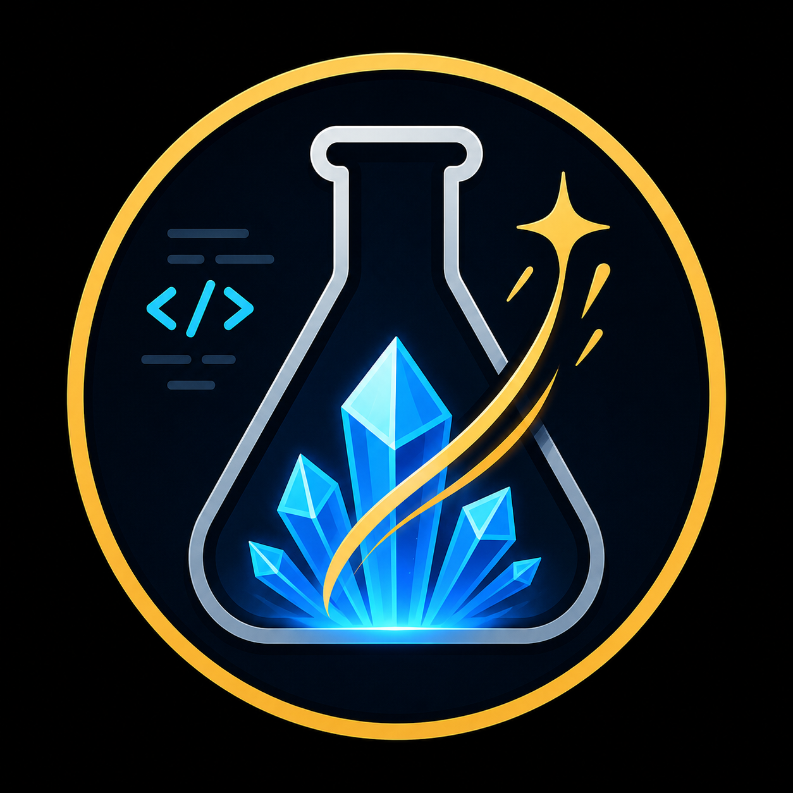

<p align="center">
  
</p>

# Catalyst for Boot.dev

> **Unofficial.** Catalyst is a community project and is not affiliated with, endorsed by, or supported by Boot.dev. It reads only your own boot.dev session data, locally in your browser.

A Manifest V3 Chrome extension that augments boot.dev with a few quality-of-life additions:

1. **All-time XP leaderboard** - adds a global all-time XP section to the leaderboard page.
2. **Cumulative profile XP** - adds lifetime XP and current-level XP progress to public user profile pages.
3. **Boss-event tracker** - tracks current, event-high, and all-time-high Boots Aura, boss damage, and chest progress.
4. **Next Lesson nav button** - adds a top-nav shortcut to the current next lesson when the extension can infer it.
5. **Personal leaderboards** - lets you save boot.dev handles and compare them in custom daily XP, all-time XP, and all-time karma boards.

## TL;DR

1. Download the latest `catalyst-v<version>.zip` from the `releases/` folder.
2. Unzip it.
3. In Chrome, open `chrome://extensions`, enable **Developer mode**, click **Load unpacked**, and select the unzipped `catalyst-v<version>` folder.
4. Visit `https://www.boot.dev`.

## Project Layout

```text
catalyst/
  bootdev-extension/       Chrome "Load unpacked" target
    manifest.json
    popup.html             Settings popup (toolbar icon)
    options.html           Settings options page (adds per-board comparisons)
    popup.js               Shared settings UI logic
    popup.css              Shared settings UI styles
    icons/                 Extension toolbar icons
    assets/frames/         Bundled avatar role frames (0-9.png)
    src/
      utils.js             Shared helpers (loaded first)
      settings.js          Feature on/off model (loaded second)
      leaderboard.js       All-time and personal leaderboard feature
      profile.js           Cumulative XP on public profile pages
      boss.js              Boss-event tracker
      nextLesson.js        Next Lesson nav link and Alt+N shortcut
      content.js           postMessage listener and URL router (loaded last)
      injected.js          Page-context fetch/XHR interceptor
      styles.css
  docs/
    branding/              Logo assets referenced by this README
  scripts/
    package-extension.sh   Builds releases/catalyst-v<version>.zip
  CLAUDE.md                Agent guidance and development conventions
  CHANGELOG.md
  README.md
```

Only `bootdev-extension/` is needed by Chrome.

## Install From Zip

Chrome loads unpacked extension folders, not zip files directly. Unzip first, then load the folder.

1. Unzip `catalyst-v<version>.zip`.
   - macOS/Windows: double-click the zip file or use the built-in Extract option.
   - Terminal:

```bash
unzip catalyst-v<version>.zip
```

2. Open Chrome and go to:

```text
chrome://extensions
```

3. Turn on **Developer mode**.
4. Click **Load unpacked**.
5. Select the unzipped `catalyst-v<version>` folder (e.g. `catalyst-v0.5.1`).
6. Open or refresh `https://www.boot.dev`.

## Updating

Catalyst is installed manually, so it does not update itself. The installed version is shown at the bottom of the settings popup and options page; compare it against the latest release on the [releases page](https://github.com/breaking-boot/catalyst/releases). You can also turn on **Automatic update checks** in the options page (off by default) to be notified in-app when a newer release is available — this makes one request a day to GitHub and nothing else.

To update:

1. Remove or replace the old unzipped `catalyst-v<old-version>` folder.
2. Unzip the new `catalyst-v<version>.zip`.
3. Go to `chrome://extensions`.
4. Click the reload button on **Catalyst for Boot.dev**.
5. Refresh any open Boot.dev tabs.

## Usage

The extension runs automatically on `www.boot.dev`. No extra sign-in flow is required — it reads JSON responses that the boot.dev page fetches using the existing boot.dev session.

### Settings

- Every feature below can be turned on or off. **Click the Catalyst toolbar icon** to open the settings popup. Chrome hides extension icons until they're pinned, so pin Catalyst from the puzzle-piece menu if you don't see it; a one-time prompt points this out on first run.
- The popup toggles the six features: Boss event tracker, Top All-Time Learners Leaderboard, Personal Leaderboards, profile cumulative XP, the Next Lesson shortcut, and leaderboard comparisons (XP/karma).
- The **options page** (toolbar icon → right-click → *Options*, or the link in the popup) adds per-board control over the XP/karma comparisons: a master toggle plus a checkbox for each of the six boards, so you can show comparisons on just the boards you want.
- Settings sync across your devices (`chrome.storage.sync`) and apply instantly — no page reload. Turning a feature off also stops its background work, so it places no load on boot.dev.

### Next Lesson

- A **Next Lesson** link is added to the top nav on all boot.dev pages once the extension learns your current lesson from `/v1/dashboard_content`. The dashboard **Continue Learning** button is used as a same-page fallback.
- Press `Alt+N` from any boot.dev page to open the Next Lesson link directly. The shortcut is ignored while typing in inputs or editors.
- Lesson progress responses trigger a delayed dashboard refresh so the link updates automatically after you complete a lesson.

### Leaderboards

#### All-Time XP

- On `https://www.boot.dev/leaderboard`, a **Top All-Time Learners** section is added below the native **Top Daily Learners** section, sourced from `/v1/leaderboard_xp/alltime`.
- Entries use role-tier avatar frames and highlight your own row. The latest response is cached so repeat visits render faster while fresh data loads.

#### Personal Leaderboards

- Also on the leaderboard page, a **Personal Leaderboards** section lets you track specific boot.dev handles across three boards: daily XP, all-time XP, and karma. Handles are stored in `chrome.storage.local`.
- On any public profile page (`https://www.boot.dev/u/<username>`), an **Add to Personal Leaderboards** button lets you save that user directly.
- **Top All-Time Learners** uses public profile XP. **Top Community Members** uses public stats karma. Both are exact.
- Personal **Top Daily Learners** is a **best-effort estimate for users other than yourself**, because boot.dev's daily board is a rolling last-24-hours window and there is no public API for another user's daily XP unless they are on a daily leaderboard (global top-25, or your league's). Each value is labeled with how it was obtained (the label sits to the left of the value), in decreasing accuracy:
  - **Plain value** — exact: the user is on the live global or league daily leaderboard right now, so Catalyst shows the same number boot.dev does.
  - **`past Nhr` note** — measured: the difference between Catalyst's own oldest and newest total-XP observations of that user within the last 24 hours. Accurate for what it saw, but blind to XP earned before the window started. Seeing a user on a daily board even once seeds a full 24h window (the board response reveals their total from exactly 24h ago), so these get good fast.
  - **`est.` note** — estimated from the user's public activity heatmap: completions today x an average XP per lesson (`ESTIMATED_XP_PER_LESSON`, currently a placeholder of 115 — being calibrated against real base-XP data), plus the daily first-clear bonus and streak multiplier. Resubmitted lessons count as activity but grant no XP, so this can overestimate. The heatmap buckets by calendar day, so activity from late yesterday that is still inside the rolling 24h window is not counted.
  - **`–`** — unavailable: Catalyst does not have enough data to show a value yet. Values improve the more you (and the boot.dev page itself) load data Catalyst can observe; hover any value for an explanation.
- All observations stay on your device (see **Privacy**); Catalyst never reports anything anywhere.
- Invalid, empty, duplicate, or nonexistent handles are rejected before being saved. If boot.dev returns an auth error, Catalyst retries once and then asks you to refresh the page.

#### XP and Karma Comparisons

- Every leaderboard entry other than your own shows a comparison — how far ahead (green) or behind (red) you are in the same unit as that board's value.
- Comparisons appear on all extension panels (Top All-Time Learners and all three Personal Leaderboards boards) and on all four native boot.dev boards: League Top Daily Learners, League Top League Learners, Global Top Daily Learners, and Global Top Community Members. Recent Archmages is left untouched.
- Your comparison value is read from the same API response that feeds each board, with a fallback to your saved personal record when absent.
- Comparisons are toggleable per board from the options page (see **Settings**), with a master switch in the popup to hide them all at once.

### Boss Event Tracker

- The boss tracker appears on boot.dev pages once boss-event data has been loaded. It tracks current Boots Aura bonus %, event-high %, all-time-high %, boss damage dealt, XP to the next chest, and XP to defeat the boss.
- Drag the tracker header to reposition it anywhere on screen. The position persists across pages.
- Use the **−** / **+** button to minimize or expand the tracker. The minimized view still shows the current aura percentage.
- Use the **gear** button to open the high settings panel. You can manually edit the event high and all-time high percentages — useful if you missed a high while the extension wasn't watching. Saving an event high above the all-time high also raises the all-time high.
- The settings panel also includes a **Refresh** button and a **Reset** button. Reset clears the current event stats while keeping the all-time high.
- Boss-event data refreshes in the background roughly every 2 minutes, and pauses while the tab is hidden. Navigating within boot.dev resets that timer and triggers a fresh fetch immediately.

### Profile Pages

- On public profile pages (`https://www.boot.dev/u/<username>`), Catalyst adds **Total XP**, current-level XP progress, and XP remaining to the next level, displayed below the native level line in the profile header.

## Troubleshooting

- If the extension does not appear, confirm that Chrome loaded the unzipped `bootdev-extension` folder, not the zip file.
- If changes do not show up after an update, click reload on the extension in `chrome://extensions`, then refresh Boot.dev.
- If a feature says a user is unavailable, try refreshing the leaderboard page. Invalid usernames are rejected and are not saved.
- Some console messages are normal page or browser noise, such as blocked ad/analytics requests or Boot.dev hydration warnings.
- If the extension was reloaded while Boot.dev was already open, refresh the Boot.dev tab to make sure the newest content script is active.

## How It Works

boot.dev is a Nuxt/Vue single-page app with rebuilt CSS class names, so the extension reads its data from intercepted API responses rather than scraping the DOM (DOM scraping is a last resort, used only for the one value boot.dev exposes nowhere else — the platform-wide student count). The main flow:

```text
page fetch/XHR -> injected.js clone -> window.postMessage -> content.js router -> UI/storage
```

`injected.js` runs in the page context and wraps `fetch` plus `XMLHttpRequest`. It clones JSON responses from `api.boot.dev` and relays them to `content.js`. `content.js` runs as the content script, routes each response by URL, injects UI, stores boss-event state in `chrome.storage.local`, and requests route-specific refreshes through the page-context script when needed.

For Next Lesson, `/v1/dashboard_content` is treated as the authoritative source because its `CurrentLessonUUID` matches the dashboard Continue Learning target. Lesson-page APIs such as `/v1/users/lessons/{lessonId}` and `/v1/course_progress_by_lesson/{lessonId}` are used only as signals to refresh dashboard content.

## Privacy

Catalyst is built to keep your data on your device:

- **It reads only your own boot.dev session data.** The extension observes the JSON responses that the boot.dev page already fetches with your existing session (leaderboards, public profiles, boss progress, dashboard content) and, on the leaderboard page, requests a few of those same public endpoints itself. It never asks for or handles your password, and your auth token is never stored, logged, or copied out of the page.
- **It stores only settings and small caches locally.** Feature on/off flags live in `chrome.storage.sync` (so they roam across your Chrome profile) as plain booleans — no personal data. Small caches (boss state, saved personal-leaderboard handles, your current handle, the next-lesson link) live in `chrome.storage.local` on your machine.
- **It transmits nothing off-device** — with one opt-in exception: if you enable **Automatic update checks**, it makes one request a day to GitHub's public API to compare version numbers. That request contains no personal data. It is off by default.
- **Permissions are minimal:** `storage`, and host access to `https://www.boot.dev/*` only. Catalyst adds no analytics and no tracking.

## Attribution & License

- Catalyst's own code is released under the [MIT License](LICENSE) © Aaron Fleming.
- The bundled avatar role frames (`assets/frames/`) and map texture (`assets/maptexture2.webp`) are Boot.dev's artwork, included so the injected UI matches the site and does not break when boot.dev redeploys. They remain the property of Boot.dev and are used with that understanding; they are not covered by the MIT license above.
- "Boot.dev" is a trademark of its owner. Catalyst is an unofficial, unaffiliated project (see the note at the top of this README).

## Development

Useful checks from the loadable extension directory:

```bash
cd bootdev-extension
node --check src/utils.js
node --check src/leaderboard.js
node --check src/profile.js
node --check src/boss.js
node --check src/nextLesson.js
node --check src/injected.js
node --check src/content.js
node -e "JSON.parse(require('fs').readFileSync('manifest.json', 'utf8')); console.log('manifest.json ok')"
```

To build a release zip, run `bash scripts/package-extension.sh` from the repo root. See `CLAUDE.md` for architecture details and agent guidance.

## Versioning

This project uses semantic versioning:

- `MAJOR`: breaking changes or major rewrites.
- `MINOR`: backwards-compatible features.
- `PATCH`: bug fixes, graceful handling, docs, packaging, and polish.

See [CHANGELOG.md](CHANGELOG.md) for full version history.