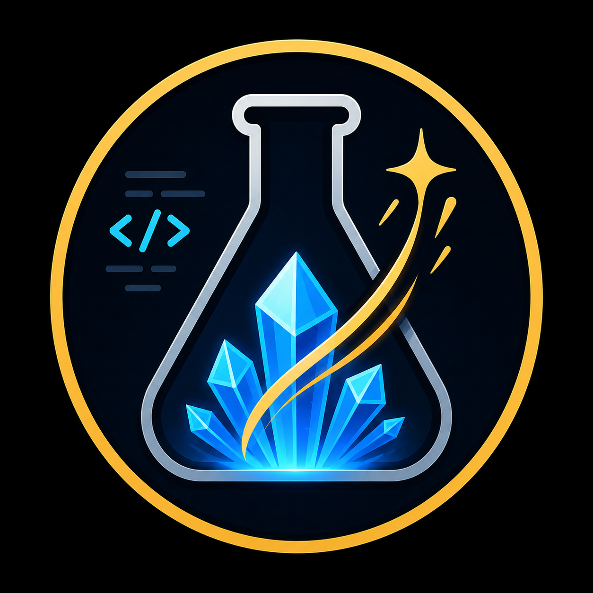

<p align="center">
  
</p>

# Catalyst for Boot.dev

> **Unofficial.** Catalyst is a community project and is not affiliated with, endorsed by, or supported by Boot.dev. It reads only your own Boot.dev session data, locally in your browser.

A Manifest V3 browser extension — for Chromium-based browsers such as Chrome and Brave (Firefox support is planned) — that augments Boot.dev with a few quality-of-life additions:

1. **Top Observed Learners** - a lifetime-XP board on the leaderboard page, assembled by Catalyst after Boot.dev removed both its all-time leaderboard and its per-user rank.
2. **Cumulative profile XP** - adds lifetime XP and current-level XP progress to public user profile pages.
3. **Boss-event tracker** - Boots Aura (current, event high, all-time high, this event's average), your own chest progress, and your guild's progress, plus alerts when the XP bonus is worth submitting on.
4. **Next Lesson nav button** - adds a top-nav shortcut to the current next lesson when the extension can infer it.
5. **Personal leaderboards** - lets you save Boot.dev handles and compare them in custom Daily XP, All-Time XP, Daily Karma, and All-Time Karma boards.

## TL;DR

1. Download the latest `catalyst-v<version>.zip` from the `releases/` folder.
2. Unzip it.
3. Open your browser's extensions page (`chrome://extensions` in Chrome, `brave://extensions` in Brave), enable **Developer mode**, click **Load unpacked**, and select the unzipped `catalyst-v<version>` folder.
4. Visit `https://www.boot.dev`.

## Project Layout

```text
catalyst/
  bootdev-extension/       Browser "Load unpacked" target
    manifest.json
    popup.html             Settings popup (toolbar icon)
    options.html           Settings options page (adds per-board comparisons)
    popup.js               Shared settings UI logic
    popup.css              Shared settings UI styles
    icons/                 Extension toolbar icons
    assets/frames/         Bundled avatar role frames (0-9.png)
    src/
      utils.js             Shared helpers (loaded first)
      settings-schema.js   Canonical settings defaults/labels (shared with the settings pages)
      settings.js          Feature on/off model
      alltime-seed.js      Bundled seed for Top Observed Learners
      allTimeRoster.js     Observed-roster storage, discovery, ordering, and refresh
      leaderboard.js       Observed-board rendering and personal leaderboards
      profile.js           Cumulative XP on public profile pages
      boss.js              Boss-event tracker
      nextLesson.js        Next Lesson nav link and Alt+N shortcut
      updateCheck.js       Opt-in GitHub release check
      trainingGrounds.js   Training Grounds level filter
      submitConfirm.js     Optional confirmation before a code submission
      cliShortcuts.js      Alt+C / Alt+Shift+C copy the lesson's bootdev commands
      assignmentShortcuts.js  Alt+0-9 tick checklist steps, Alt+` returns to your code
      content.js           postMessage listener and URL router (loaded last)
      injected.js          Page-context fetch/XHR interceptor
      backup.js            Backup & restore core (options page only, not a content script)
      styles.css
  docs/
    branding/              Logo assets referenced by this README
  scripts/
    package-extension.sh   Builds releases/catalyst-v<version>.zip
  CLAUDE.md                Agent guidance and development conventions
  CHANGELOG.md
  README.md
```

Only `bootdev-extension/` is needed by the browser.

## Install From Zip

Browsers load unpacked extension folders, not zip files directly. Unzip first, then load the folder:

Unzip `catalyst-v<version>.zip`.
   - macOS/Windows: double-click the zip file or use the built-in Extract option.
   - Terminal:

```bash
unzip catalyst-v<version>.zip
```

### Chrome

1. Open Chrome and go to `chrome://extensions`.
2. Turn on **Developer mode**.
3. Click **Load unpacked**.
4. Select the unzipped `catalyst-v<version>` folder (e.g. `catalyst-v0.8.0`).
5. Open or refresh `https://www.boot.dev`.

### Brave

Brave runs Chrome extensions natively, so Catalyst works in Brave with no changes.

1. Open Brave and go to `brave://extensions`.
2. Turn on **Developer mode** (top-right toggle).
3. Click **Load unpacked**.
4. Select the unzipped `catalyst-v<version>` folder (e.g. `catalyst-v0.8.0`).
5. Open or refresh `https://www.boot.dev`.

One Brave-specific note: settings save normally, but they may not roam across devices — Brave does not sync extension data, so `chrome.storage.sync` behaves like local storage there.

### Firefox

Not yet supported; Firefox support is planned for a future release.

## Updating

Catalyst is installed manually, so it does not update itself. The installed version is shown at the bottom of the settings popup and options page; compare it against the latest release on the [releases page](https://github.com/breaking-boot/catalyst/releases). You can also turn on **Automatic update checks** in the options page (off by default) to be notified in-app when a newer release is available — this makes one request a day to GitHub and nothing else.

To update:

1. Remove or replace the old unzipped `catalyst-v<old-version>` folder.
2. Unzip the new `catalyst-v<version>.zip`.
3. Go to your browser's extensions page (`chrome://extensions` / `brave://extensions`).
4. Click the reload button on **Catalyst for Boot.dev**.
5. Refresh any open Boot.dev tabs.

If an update ever requires **removing and re-adding** the extension (rather than reloading in place), export a backup first — removing an extension deletes its stored data. See **Backup & restore** below.

## Usage

The extension runs automatically on `www.boot.dev`. No extra sign-in flow is required — it reads JSON responses that the Boot.dev page fetches using the existing Boot.dev session.

### Settings

- Every feature below can be turned on or off. **Click the Catalyst toolbar icon** to open the settings popup. Chromium browsers hide extension icons until they're pinned, so pin Catalyst from the puzzle-piece menu if you don't see it; a one-time prompt points this out on first run.
- The popup toggles the twelve features: Boss event tracker (off by default), Boss event reminders, boss aura alerts, Top Observed Learners, Personal Leaderboards, profile cumulative XP, the Next Lesson shortcut, the Training Grounds level filter, the CLI command shortcuts, the checklist step shortcuts (off by default), code submission confirmation (off by default), and leaderboard comparisons (XP/karma).
- The **options page** (toolbar icon → right-click → *Options*, or the link in the popup) adds finer control: a toggle for each of the four Personal Leaderboards boards (Daily XP, All-Time XP, Daily Karma, All-Time Karma — switching all four off hides the whole section until one is turned back on), and per-board control over the XP/karma comparisons (a master toggle plus a checkbox for each of the six boards).
- Settings sync across your devices (`chrome.storage.sync`; in Brave they stay on-device) and apply instantly — no page reload. Turning a feature off stops any polling or requests it owns, so it adds no load to Boot.dev.

### Backup & restore

- The options page has a **Backup & restore** section. **Export data** downloads a JSON file (`catalyst-backup-YYYY-MM-DD.json`) containing your settings, tracked Personal Leaderboards learners, XP/karma snapshot history, your own karma comparison series, and boss stats. **Import data** picks a backup file, shows you what's inside, and applies it only after you confirm. The file is created locally and never uploaded anywhere.
- Importing **merges data and replaces settings** — tracked learners are combined with your current list, snapshot history and boss highs merge (the boss event high, and the aura history behind the event average, only count if the backup is from the currently running event), and your toggles are restored exactly as exported. An import never deletes anything.
- Use it before removing/reinstalling the extension, to move Catalyst to another machine, or to sync settings between devices on Brave (which doesn't sync extension data).
- One honest caveat: XP/karma snapshot history only lives ~24 hours by design (it measures a rolling window), so a backup restores full comparison accuracy only when imported soon after export. Older backups still restore your learners, settings, and boss stats; the expired measurement window simply rebuilds as you browse.
- Power users: the file's sections (`settings`, `personalLeaderboard`, `currentUser`, `bossState`) are independent — deleting a section from the JSON before importing skips just that part.

### Next Lesson

- A **Next Lesson** link is added to the top nav on all Boot.dev pages once the extension learns your current lesson from `/v1/dashboard_content`. The dashboard **Continue Learning** button is used as a same-page fallback.
- Press `Alt+N` from any Boot.dev page to open the Next Lesson link directly. It works while you're typing too, the same as Boot.dev's own `Ctrl+.` shortcut.
- Lesson progress responses trigger a delayed dashboard refresh so the link updates automatically after you complete a lesson.

### Lessons

- **CLI command shortcuts.** On any lesson that shows `bootdev` commands (courses and projects), press `Alt+C` to copy the run command and `Alt+Shift+C` to copy the submit command — Shift means submit, the same as Boot.dev's own `Ctrl+Enter` / `Ctrl+Shift+Enter`. A short toast confirms what was copied.
- Catalyst copies the command **the page actually displays** for the lesson you're on. On "safe submission" lessons, which show a submit command but no run command, `Alt+Shift+C` works and `Alt+C` copies nothing rather than inventing an unsupported command. On lessons with no CLI commands the shortcuts stay silent and leave your clipboard untouched. They work while you're typing in the editor or a text box as well (ordinary `Ctrl+C` copying is unaffected — these need Alt).
- **Checklist step shortcuts** (off by default). On any lesson or challenge with checkbox steps, `Alt+1` through `Alt+9` tick the matching numbered step and `Alt+0` ticks the next unfinished box anywhere in the list. Pressing the same Alt-number again unticks it, so a mis-tick costs one keypress. Once a box is focused, `Space` toggles it and `Tab` / `Shift+Tab` move through the rest — including nested sub-steps, which Catalyst deliberately doesn't try to number.
- **<code>Alt+\`</code> returns you to the answer side** — your code editor, the Linux course terminal, the interview answer box, or the repo-URL field — from wherever you are on the page, with your cursor exactly where you left it. It's the return trip for `Alt+0`, and the two together mean you never touch the mouse to work through a checklist. The key sits just left of `Alt+1`, so the whole feature is one row of the keyboard.
- All of these work **while you're typing**, including in the code editor and the course terminal — that's the point, since marking a step off shouldn't mean reaching for the mouse. `Alt+0` recalculates each press, so it always lands on the first unfinished box in reading order and does nothing once everything is ticked. Steps that aren't checkboxes are skipped, and when a lesson restarts its numbering under a second heading, `Alt+1` targets the first step 1 on the page. Catalyst clicks Boot.dev's own checkbox, so your progress is recorded exactly as if you'd clicked it.
- Off by default on purpose: on some Mac keyboard layouts `Alt+3` types `#`. Numpad digits are deliberately not used, so Windows `Alt`+numpad character codes still work.
- **Confirm code submissions** (off by default). Turn it on and clicking **Submit** on a code lesson asks first, so a lagging mouse or a stray click can't forfeit a streak or spree. Cancel and `Escape` leave the lesson untouched; confirming submits once through Boot.dev's own button.
- The confirmation covers mouse and touch clicks only — the accidental case. Boot.dev's deliberate `Ctrl+Shift+Enter` submit shortcut, the Run and Solution buttons, quiz answers, and interview submissions all behave exactly as before.
- It stays out of the way where a failed submission costs nothing. Boot.dev protects your Sharpshooter spree on a lesson you have completed, on one that has already broken an armor, and while you are holding armor — but that last case spends an armor, which is the very thing worth warning about. So the confirmation goes quiet on the first two: a lesson you have already completed, or one that has already cost you an armor there. A lesson you merely attempted before still asks, because failing it again really does cost you. Resetting a lesson does not by itself make it safe: Catalyst still asks when neither persistent protection applies, while a prior completion or armor use continues to suppress the dialog because those protections survive the reset. When Catalyst cannot tell what state a lesson is in, it asks.

### Training Grounds

- **Every result shows its difficulty level.** Boot.dev prints the number only in the difficulty icon's hover tooltip, so finding the level 10 challenges means hovering each icon in turn. Catalyst prints it next to the icon instead.
- **Filter to an exact level.** Boot.dev's own difficulty filter narrows to Easy, Medium, or Hard — but "Hard" is levels 8, 9 and 10, and the level 10 challenges are worth the most XP. Pick a difficulty with Boot.dev's filter and the Catalyst **Difficulty Level** section below it offers the individual levels inside it: choose Hard, then ask for only 10.
- Levels are offered only once a difficulty is chosen — the Difficulty Level section says so until then. Without a difficulty, results are spread across all ten levels, so picking just one would return very few challenges for reasons that have nothing to do with the filter.
- It behaves exactly like the native pills: picks apply when you run the search (press `Enter` in the search box), "Clear filters" clears them too, and each browser tab keeps its own selection. Selecting every level in the difficulty is the same as not filtering at all.
- Your level choice follows you around the site the same way Boot.dev's difficulty does — leave the search page and come back, or use the browser's Back and Forward buttons, and it's still there. It is dropped whenever Boot.dev drops its own difficulty, so the two can never disagree, and nothing about it is saved between browser sessions.
- The filtered result list, the "Showing X-Y of Z" count, and the Prev/Next pages are all genuinely correct for the filtered set — Catalyst filters the search response before the page renders it, rather than hiding cards afterwards.
- While a filter is applied, a small **gold dot** marks the **Filter** button, and the page URL carries it (`dl=10`) — copy the URL and another Catalyst user opens the same filtered search. Older shared links using the previous `diff=` format simply load unfiltered.
- Challenges whose difficulty can't be read are never hidden, and if anything unexpected happens the page simply gets its normal unfiltered results.

### Leaderboards

#### Top Observed Learners

- A **Top Observed Learners** section on `https://www.boot.dev/leaderboard`, with role-tier avatar frames and your own row highlighted.
- **Why it is called "Observed", and why that matters.** Boot.dev removed its all-time leaderboard in August 2026, and a week later removed the per-user rank from profiles too — a profile now shows a band such as "Top 1%" instead. That band is far too coarse to order anybody: when first measured, a single value covered everyone from about 930,000 to 1,740,000 lifetime XP, and even the finest band seen since still covers well over a thousand learners. The leaderboard and profile sources Catalyst has identified therefore no longer provide an exact all-time position. Catalyst orders the learners it has seen by lifetime XP instead. A number on this board means "Nth highest XP among the learners Catalyst has observed" — not "Nth on Boot.dev".
- **It ships knowing where to start.** The extension bundles a seed of observed high-XP learners, so a new installation shows a full board immediately, with no waiting and no network round-trip.
- **It keeps its known learners current as you browse.** XP is picked up from responses Boot.dev's own pages already make — every profile you open, every native board — and each time you open or reload the leaderboard Catalyst refreshes a few more known learners. A fresh installation can refresh the bundled roster over a handful of loads; continued browsing also discovers learners the seed did not know about. **At most 12 requests per load**, and at most one such pass every five minutes.
- **It still discovers new learners, but more slowly.** Any learner Catalyst sees with enough lifetime XP to belong is picked up automatically from Boot.dev's native boards or from a profile you open. Catalyst previously also used Boot.dev's `week` and `month` XP API timeframes, which were the best passive sources for learners approaching the top. Those timeframes are no longer available, and no remaining source reliably lists that group, so new high-XP learners may take longer to appear. Refreshing the bundled seed in future releases can help fill that gap.
- Learners you already know never disappear on their own. Leaving the leaderboard alone for a month changes nothing; the board is refreshed the next few times you visit.
- The subtitle shows **your own percentile** — the remaining all-time standing signal Boot.dev publishes through public stats — against the current total number of learners. Catalyst displays it as a percentile and never converts it into an exact rank.
- Hover any row to see when its XP was last read.

#### Personal Leaderboards

- Also on the leaderboard page, a **Personal Leaderboards** section lets you track specific Boot.dev handles across four side-by-side boards: **Daily XP**, **All-Time XP**, **Daily Karma**, and **All-Time Karma**. Handles are stored in `chrome.storage.local`. Each board can be toggled individually from the options page; all four off hides the section entirely.
- On any public profile page (`https://www.boot.dev/u/<username>`), an **Add to Personal Leaderboards** button lets you save that user directly.
- **All-Time XP** uses public profile XP. **All-Time Karma** uses public stats karma, the same figure shown on that user's profile page. Both are exact.
- **Boot.dev exposes two slightly different karma totals for the same user.** Public profile/stats karma and the native Top Community Members board differed by 0-44 points across the accounts tested, with a stable gap per user. Catalyst uses the profile/stats figure throughout Personal Leaderboards and the native board's figure for comparisons on that board, so each comparison is internally consistent. This means Personal Leaderboards' All-Time Karma value may be a few points lower than the native board.
- **Daily XP** is a **best-effort estimate for users other than yourself**, because Boot.dev's daily board is a rolling last-24-hours window and there is no public API for another user's daily XP unless they are on a daily leaderboard (global top-25, or your league's). Each value is labeled with how it was obtained (the label sits to the left of the value), in decreasing accuracy:
  - **Plain value** — exact: the user is on the live global or league daily leaderboard right now, so Catalyst shows the same number Boot.dev does.
  - **`past Nhr` note** — measured: the difference between Catalyst's own oldest and newest total-XP observations of that user within the last 24 hours. Accurate for what it saw, but blind to XP earned before the window started. Seeing a user on a daily board even once seeds a full 24h window (the board response reveals their total from exactly 24h ago), so these get good fast.
  - **`est.` note** — estimated from the user's public activity heatmap: completions today x an average XP per lesson (`ESTIMATED_XP_PER_LESSON`, currently a placeholder of 115 — being calibrated against real base-XP data), plus the daily first-clear bonus and streak multiplier. Resubmitted lessons count as activity but grant no XP, so this can overestimate. The heatmap buckets by calendar day, so activity from late yesterday that is still inside the rolling 24h window is not counted.
  - **`–`** — unavailable: Catalyst does not have enough data to show a value yet. Values improve the more you (and the Boot.dev page itself) load data Catalyst can observe; hover any value for an explanation.
- **Daily Karma** is likewise measured, not native: Boot.dev has no daily karma leaderboard and no per-day karma API at all, so the only possible source is Catalyst diffing its own karma observations of each tracked user inside the same rolling 24-hour window (`past Nhr` note, hover for details). An observed karma gain shows as soon as Catalyst sees it; a confident **0** needs a watched window of at least ~30 minutes, and a user shows `–` before that. Since nothing backdates karma the way a daily-board sighting backdates XP, the measured window only starts when Catalyst first sees the user's karma — values firm up the longer the day goes on. There is no exact or estimated tier for karma. Comparisons on this board apply the same measurement to you (Catalyst records your own karma too, adding one stats request on leaderboard visits), so they appear once your own watched window is wide enough — immediately if Catalyst sees you gain karma.
- All observations stay on your device (see **Privacy**); Catalyst never reports anything anywhere.
- Invalid, empty, duplicate, or nonexistent handles are rejected before being saved. If Boot.dev returns an auth error, Catalyst retries once and then asks you to refresh the page.

#### XP and Karma Comparisons

- Every leaderboard entry other than your own shows a comparison — how far ahead (green) or behind (red) you are in the same unit as that board's value.
- Comparisons appear on all extension panels (all four Personal Leaderboards boards, and Top Observed Learners) and on all four native Boot.dev boards: League Top Daily Learners, League Top League Learners, Global Top Daily Learners, and Global Top Community Members. Recent Archmages is left untouched.
- Native-board comparisons use your value from the same response that feeds that board when available. This includes the karma board, whose figures differ slightly from the profile/stats karma Catalyst uses elsewhere (see **Personal Leaderboards**). Top Observed Learners uses XP observed for you in the current session rather than restoring your value from the stored roster, so stale roster data cannot become the comparison baseline.
- Comparisons are toggleable per board from the options page (see **Settings**), with a master switch in the popup to hide them all at once.

### Boss Event Tracker

- The boss tracker is **off by default** so nothing floats over the page until you ask for it. Turn it on from the settings popup — or just wait: when a boss event is live and the tracker is hidden, Catalyst shows a small **reminder toast** with a **Show Tracker** button (turns the tracker on) and a **Don't remind me for this event** button (silences reminders for that event only). The reminder appears at most once a day per event, and the **Boss event reminders** toggle turns reminders off entirely.
- While the tracker is off, Catalyst makes no boss-event requests of its own — event detection piggybacks on the responses the Boot.dev page already fetches. It does **record** what those responses say, so turning the tracker on part-way through an event shows the history it could have had rather than starting blank.
- Once enabled, the tracker appears on Boot.dev pages when boss-event data has been loaded. It shows three things:
  - **Boots Aura** - the current bonus %, the highest seen this event, the highest ever seen, this event's running average, how far the current bonus sits below the event high, and the number of lessons the whole site completed this hour (the figure the bonus is derived from).
  - **Your fight** - your event XP against the four chest milestones, with the next chest named and the XP still needed. Once all four are earned it reads *Boss defeated*.
  - **Your guild** - one guild at a time: its name, how many members have qualified, and its XP against the guild goal. Before any guild completes, Catalyst shows the one closest to finishing; once a guild completes, it shows that one for the rest of the event. A guild needs two qualified members before its XP counts at all, and the panel says so rather than leaving you with an unexplained 0.
- Values whose meaning is not obvious from their label carry a small info mark; hover it for an explanation. Anything without one needs none.
- **"Event high" means the highest bonus Catalyst saw**, which is not the event's peak if the tracker was off for part of it. The panel states the window it has been watching, so a high recorded on day three is not mistaken for the event's best.
- When an event ends, its final numbers stay on screen behind a *Final* banner, and a one-line summary of it survives into the next event (visible in the gear panel). Boot.dev zeroes the live bonus at that point, so the current aura, the gap below the event high, and lessons this hour read as unavailable rather than as a real zero; the highs, the average and your results stay.
- Drag the tracker header to reposition it anywhere on screen. The position persists across pages.
- Use the **−** / **+** button to minimize or expand the tracker. The minimized view still shows the current aura while the event is live.
- Use the **×** button to close the tracker — it switches the Boss event tracker setting off in one click (turn it back on anytime from the popup). Closing also mutes reminder toasts for the current event.
- Use the **gear** button to open the settings panel. You can manually edit the event high and all-time high percentages — useful if you missed a high while the extension wasn't watching — and set **Min aura to alert %** (see alerts below). **Apply changes** saves all three. Saving an event high above the all-time high also raises the all-time high, and editing a high re-arms the alerts so a level already announced can announce again.
- The settings panel also includes a **Refresh** button and a **Reset** button. Reset clears the current event stats while keeping the all-time high.
- Boss-event data refreshes in the background roughly every 2 minutes, and pauses while the tab is hidden. Navigating within Boot.dev resets that timer and triggers a fresh fetch immediately.

**Aura alerts** (the **Boss aura alerts** toggle, on by default, active only while the tracker is on):

- **New all-time high** - the strongest alert, and the only one that waits for you to dismiss it.
- **New event high** - the bonus beat this event's previous best.
- **Near the event high** - within 80% of it, so worth submitting on now.
- **Well above this event's average** - the bonus is unusually good for this event even though it is nowhere near a record.
- The last two only fire at or above **Min aura to alert %** in the gear panel (40% by default); a new high always alerts regardless. Only the most important alert fires at a time, each has a cooldown, and every alert also leaves a line in the panel — a toast is easy to miss, the panel is not. The line can be dismissed and disappears on its own after a few hours.

### Profile Pages

- On public profile pages (`https://www.boot.dev/u/<username>`), Catalyst adds **Total XP**, current-level XP progress, and XP remaining to the next level directly beneath the level progress bar.
- Boot.dev already labels the two ends of that bar with current-level XP and the next-level threshold. While the feature is enabled, Catalyst hides those two native labels and presents the same values together with XP remaining in one line. The native labels are hidden, not removed, and reappear when the feature is switched off.
- Total XP remains useful even though the rebuilt profile page can show an **XP EARNED** tile. That tile is not always present: profiles with several completed paths can show **PATH COMPLETED** tiles instead, leaving no native lifetime-XP total. Boot.dev also does not show XP remaining to the next level.

## Troubleshooting

- If the extension does not appear, confirm that the browser loaded the unzipped `bootdev-extension` folder, not the zip file.
- If changes do not show up after an update, click reload on the extension in your browser's extensions page (`chrome://extensions` / `brave://extensions`), then refresh Boot.dev.
- If a feature says a user is unavailable, try refreshing the leaderboard page. Invalid usernames are rejected and are not saved.
- Some console messages are normal page or browser noise, such as blocked ad/analytics requests or Boot.dev hydration warnings.
- If the extension was reloaded while Boot.dev was already open, refresh the Boot.dev tab to make sure the newest content script is active.

## How It Works

Boot.dev is a Nuxt/Vue single-page app with rebuilt CSS class names, so Catalyst gets feature data from intercepted or explicitly requested API responses wherever possible and treats DOM reads as a last resort. The platform-wide learner count now comes from `/v1/leaderboard_stats`; rendered page data is used only where no suitable API source is available. The main flow:

```text
page fetch/XHR -> injected.js clone -> window.postMessage -> content.js router -> UI/storage
```

`injected.js` runs in the page context and wraps `fetch` plus `XMLHttpRequest`. It clones JSON responses from `api.boot.dev` and relays them to `content.js`. `content.js` runs as the content script, routes each response by URL, injects UI, stores boss-event state in `chrome.storage.local`, and requests route-specific refreshes through the page-context script when needed.

For Next Lesson, `/v1/dashboard_content` is treated as the authoritative source because its `CurrentLessonUUID` matches the dashboard Continue Learning target. `/v1/course_progress_by_lesson/{lessonId}` is used only as a signal to refresh dashboard content. `/v1/users/lessons/{lessonId}` also feeds the optional submit-confirmation risk gate: Catalyst normally reads Boot.dev's own response, and requests it only when that lesson's state has not been observed yet and the confirmation setting is on.

## Privacy

Catalyst is built to keep your data on your device:

- **It reads only your own Boot.dev session data.** The extension observes the JSON responses that the Boot.dev page already fetches with your existing session (leaderboards, public profiles, boss progress, dashboard content, lesson history) and, when a feature needs data the page has not already fetched, requests the relevant Boot.dev endpoint itself. That includes public leaderboard/profile data and, if submit confirmation is enabled and a lesson's risk state is still unknown, that lesson's own history endpoint. It never asks for or handles your password, and your auth token is never stored, logged, or copied out of the page.
- **It stores only settings and small caches locally.** Feature on/off flags live in `chrome.storage.sync` (so they roam across your browser profile; Brave keeps them on-device) as plain booleans — no personal data. Small caches (boss state, saved personal-leaderboard handles, the observed lifetime-XP roster and learner count, your current handle, and the next-lesson link) live in `chrome.storage.local` on your machine.
- **It transmits nothing off-device** — with one opt-in exception: if you enable **Automatic update checks**, it makes one request a day to GitHub's public API to compare version numbers. That request contains no personal data. It is off by default.
- **Permissions are minimal:** `storage`, and host access to `https://www.boot.dev/*` only. Catalyst adds no analytics and no tracking.

## Attribution / License

- Catalyst's own source code is released under the [MIT License](LICENSE) © Aaron Fleming.
- Some Boot.dev visual assets are bundled with permission and are not covered by the MIT License. See [ATTRIBUTION.md](ATTRIBUTION.md) for details.
- "Boot.dev" is a trademark of its owner. Catalyst is an unofficial, unaffiliated project (see the note at the top of this README).

## Development

Useful checks from the loadable extension directory:

```bash
cd bootdev-extension
node --check src/utils.js
node --check src/settings-schema.js
node --check src/settings.js
node --check src/alltime-seed.js
node --check src/allTimeRoster.js
node --check src/leaderboard.js
node --check src/profile.js
node --check src/boss.js
node --check src/nextLesson.js
node --check src/updateCheck.js
node --check src/trainingGrounds.js
node --check src/submitConfirm.js
node --check src/cliShortcuts.js
node --check src/assignmentShortcuts.js
node --check src/injected.js
node --check src/content.js
node --check src/backup.js
node --check popup.js
node -e "JSON.parse(require('fs').readFileSync('manifest.json', 'utf8')); console.log('manifest.json ok')"
node ../scripts/check_challenge_filter.mjs
node ../scripts/check_lesson_features.mjs
node ../scripts/check_boss_normalizer.mjs
node ../scripts/check_next_lesson.mjs
node ../scripts/check_leaderboard_avatar.mjs
node ../scripts/check_leaderboard_casing.mjs
node ../scripts/check_endpoint_tripwire.mjs
node ../scripts/check_alltime_roster.mjs
node ../scripts/check_snapshot_series.mjs
node ../scripts/check_profile_anchor.mjs
node ../scripts/check_cross_tab_merge.mjs
```

To build a release zip, run `bash scripts/package-extension.sh` from the repo root. See [CLAUDE.md](CLAUDE.md) for architecture details and agent guidance.

## Versioning

This project uses semantic versioning:

- `MAJOR`: breaking changes or major rewrites.
- `MINOR`: backwards-compatible features.
- `PATCH`: bug fixes, graceful handling, docs, packaging, and polish.

See [CHANGELOG.md](CHANGELOG.md) for full version history.
